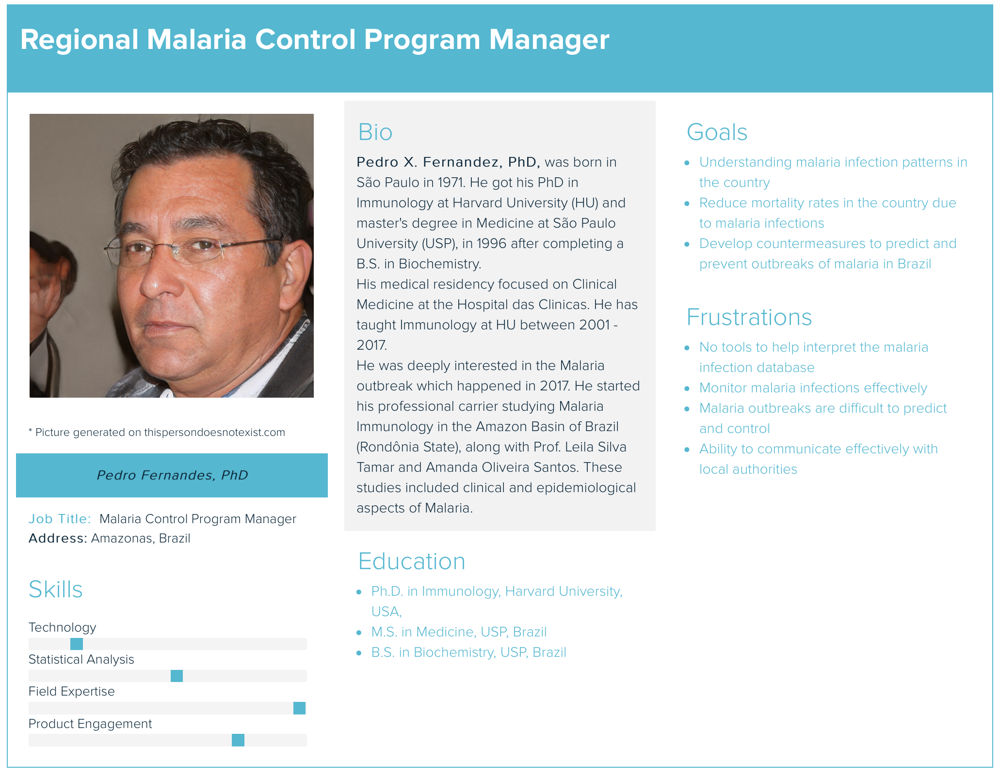

# imported-malaria-monitor

## Team "Malaria Monitors"

- Fatma: Dev Team Member
- Vikram: Dev Team Member
- Derek: Dev Team Member & Project Owner
- Karen: Dev Team Member & Scrum Master

## Product "Imported Malaria Monitor"

__Far Vision:__ Control and eliminate malaria globally.

__Near Vision:__ Prevent malaria outbreaks by enabling informed programmatic actions on the ground.

## Product Stakeholders & Personas

Real person Stakeholder (Researcher): Marcia Castro, PhD

## Product Backlog

Trello PBI Board: ["Imported Malaria Monitor" Product Backlog](https://trello.com/b/2R8EOqim/imported-malaria-monitor "Imported Malaria Monitor Product Backlog")

### Product Backlog Order Rational

The product backlog is ordered based on a MVP (Minimal Viable Product) criteria and the feature priorities state by the stakeholder.

## Definition of Ready

A Product Backlog Item (PBI) is "ready" for a consideration in a sprint when:

* It has a title
* It has a User Story opening sentence
* It has an estimate in story points
* Its user story identifies its business value
* Its acceptance criteria are clear and testable
* Its details are sufficiently understood by the development team so it can make an informed decision as to whether it can be completed in one sprint
* It is small enough to comfortably be completed in one sprint
* Its clear how the Definition of Done can apply to its completion
* Its dependencies are identified and no external dependencies would block the PBI from being completed (i.e. tool, skills,resources are available)
* The team understands how to demonstrate the PBI at the sprint review

### Relative Size Estimates

Relative size estimates of story board points was done by Planning Poker. It was facilitated by the web tool https://play.planningpoker.com

Only developmental team members participated in creating the estimates.

## Definition of Done
- There are unit tests
- Unit tests are automated
- All unit tests pass
- Design decisions are documented (in-line is Ok)
- Code reviewed, questions/problems are resolved
- No objections from dev team
- Passes all acceptance tests
- Code builds
- Code is committed
- No technical debt
- Stakeholders agree that it's done

## SPRINT 1

### Forecast Velocity
Our initial velocity forecast is of 7 Story Points per Sprint. Our forecast is primarily based on the limited time we have (considering the holiday, too) and choosing the right tools to initialize the project. As we progress, we expect to increase the velocity.

### Sprint Backlog

#### Online malaria database (E1)
User Story: 
As a malaria researcher, I want an online database to record cases of malaria.

Additional Details:
- Researchers and healthcare institutions currently have no standard way of storing and accessing malaria infection cases

Acceptance Criteria:
- An online database exists
- The online database is capable of storing malaria infection records

#### Authentication-enabled malaria patient records (E2)
User Story: 
As a malaria control program manager, I want a secure way of recording malaria infection cases that include patient data.

Additional Details:
- The access to malaria infections is hard in most cases because the healthcare institutions have no way of sharing the data easily with organization or researchers
- The malaria infection cases include patient information which is categorized as PII (Personal Identifiable Information). Therefore, the information is sensitive in nature and cannot be publicly available.

Acceptance Criteria:
- An online database exists
- The database is only accessible by means of a secure login interface, so only authorized users with accounts can access the information

#### Map of Brazil with counties boundaries (E2)
User Story: 
As a researcher, I want a map showing Brazil all Brazilian counties as defined by the IBGE institution to assist in my research of malaria diagnosed locations.

Additional Details:
- The IBGE is a governmental institution that divides the Brazilian territories into counties (districts).
- Malaria cases are recorded by county because of the healthcare system infrastructure and because it provides enough granularity to address and control disease outbreaks.

Acceptance Criteria:
- The usual Definition of Done
- The map displays in a window
- The map supports zoom in/out functionality
- The map displays the names of each county

#### Browser accessible malaria monitoring application for 0 cases (E2)
User Story: 
As a malaria control program manager, I want an application to see zero cases of malaria in Brazil.

Additional Details:
- Currently, there is no convenient way to track malaria cases in Brazil.
- Program managers seek a way to visualize malaria cases in the country through a simple web application that could be accessed through a web-browser

Acceptance Criteria:
- The usual Definition of Done
- A web-capable application exists that can be accessed through a web-browser
- The web application displays a map of Brazil showing 0 cases of malaria

### What did you do in the last 24 hours that helped the Development Team meet the Sprint Goal? Annotate your team's response so it's clear which team members did which activities.
#### Karen
- Researched map components for web app
- Worked on frontend project using angular framework to incorporate map to app
#### Vikram
- Created backend of website 
- Implemented login functionality
#### Fatma
- Documented project
- Reviewed sprint backlog and formulated user stories
- Decomposed sprint item into tasks
#### Derek
- Researched backend (Django) and frontend (angular) functionalities 
- Setup backend and frontend
- Researched how to integrate front-end and backend

### What will you do in the next 24 hours to help the Development Team meet the Sprint Goal? Annotate your team's response so it's clear which team members plan to do which activities.

#### Karen
- Finish incorporating maps into frontend
- Implement frontend API to request message from backend
#### Vikram
- Finalize backend functionality
- Implement backend API to respond to frontend requests
#### Fatma
- Write tests
- Document project
#### Derek
- Arrange meeting with Stakeholder
- Document project
