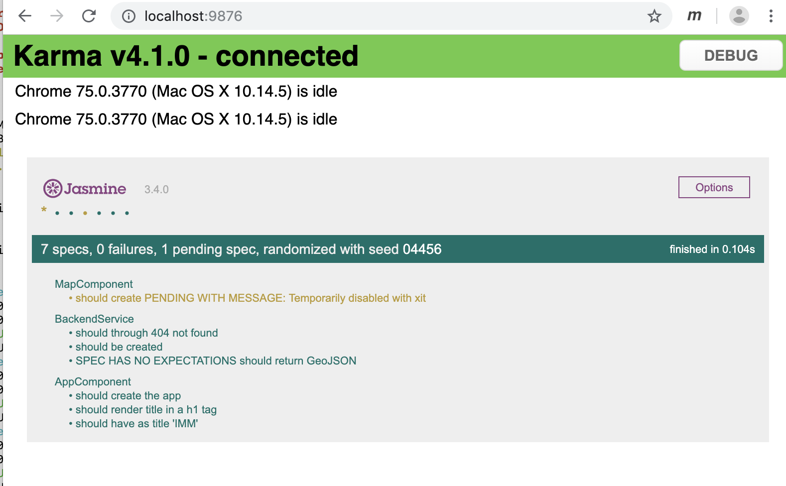

# imported-malaria-monitor

## Team "Malaria Monitors"

- Fatma: Dev Team Member
- Vikram: Dev Team Member
- Derek: Dev Team Member & Project Owner
- Karen: Dev Team Member & Scrum Master

## Product "Imported Malaria Monitor"

__Far Vision:__ Control and eliminate malaria globally.

__Near Vision:__ Prevent malaria outbreaks by enabling informed programmatic actions on the ground.

## Product Stakeholders & Personas

Real person Stakeholder (Researcher): Marcia Castro, PhD

## Product Backlog

Trello PBI Board: ["Imported Malaria Monitor" Product Backlog](https://trello.com/b/2R8EOqim/imported-malaria-monitor "Imported Malaria Monitor Product Backlog")

### Product Backlog Order Rational

The product backlog is ordered based on a MVP (Minimal Viable Product) criteria and the feature priorities state by the stakeholder.

## Definition of Ready

A Product Backlog Item (PBI) is "ready" for a consideration in a sprint when:

* It has a title
* It has a User Story opening sentence
* It has an estimate in story points
* Its acceptance criteria are clear and testable
* Its details are sufficiently understood by the development team so it can make an informed decision as to whether it can be completed in one sprint
* It is small enough to comfortably be completed in one sprint
* The team understands how to demonstrate the PBI at the sprint review

### Relative Size Estimates

Relative size estimates of story board points was done by Planning Poker. It was facilitated by the web tool https://play.planningpoker.com

Only developmental team members participated in creating the estimates.

## Definition of Done
- There are unit tests
- All unit tests pass
- Design decisions are discussed
- No objections from dev team
- Passes all acceptance tests
- Code builds
- Code is committed

## SPRINT 1 (Due July 4th, 3 pm)

### Forecast Velocity
Our initial velocity forecast is of 8 Story Points per Sprint. Our forecast is primarily based on setting up the infrastructure and choosing the right tools for backend and frontend development since this is our first sprint. We also had limited time (considering the week days and holiday, too) for this Sprint. As we progress, we expect to increase the velocity. 

### Sprint Backlog 
This is the link to the Sprint Backlog and Tasks can be found here: https://trello.com/b/2R8EOqim/imported-malaria-monitor
We refined the stories that are larger than half of our velocity. The current board reflects the newest state of the stories and tasks after refinement.

### What did you do in the last 24 hours that helped the Development Team meet the Sprint Goal? Annotate your team's response so it's clear which team members did which activities.
#### Karen
- Researched map components for web app
- Worked on frontend project using angular framework to incorporate map to app
- Migrated Leaflet geoJson render into Angular framework

#### Vikram
- Created backend of website 
- Implemented login functionality

#### Fatma
- Documented project
- Reviewed sprint backlog and formulated user stories
- Decomposed sprint item into tasks

#### Derek
- Researched backend (Django) and frontend (angular) functionalities 
- Setup backend and frontend
- Researched how to integrate front-end and backend

### What will you do in the next 24 hours to help the Development Team meet the Sprint Goal? Annotate your team's response so it's clear which team members plan to do which activities.

#### Karen
- Finish integrating maps into frontend
- Implement frontend API to request message from backend

#### Vikram
- Finalize backend functionality
- Implement backend API to respond to frontend requests

#### Fatma
- Document project
- Research CI/CD tools (Jenkins) for the next Sprint

#### Derek
- Arrange meeting with Stakeholder
- Document project

### Impediments we had and how we removed them
- We had to further decompose the original story because we realized some of the tasks are actually stories on its own. We removed the impediment by refining the stories.

- Having a holiday as the last day of our Sprint was another impediment because it was hard to contact our stakeholder and arrange a meeting with the team. We overcame this impediment by having a video conference meeting with the development team (also has P.O. and S.M.), and our stakeholder met with P.O.

- Having this as our first Sprint brought some difficulties such as choosing the right tools to maximize the productivity of our team considering team member's strengths and skills. 
  Being a newly formed team and not knowing each other's technical skills resulted in longer discussions on who should do what. 
We had many meetings and there were a lot of back and forth discussions which solved the issue.

### Sprint 1 Burndown

### Sprint 1 Mob Programming & Pair Programming

Vikram receives gold star for effort!

- Mob programming on front end development.
- Vikram & Derek paired programmed on Wednesday after class.

### Sprint 1 TDD

The Imported Malaria Monitor is composed of two sub-projects. The back end, Django, and the front end, Angular.io. This repository contains these projects under sub directories front-end and back-end.

#### Front-End UI

The "front-end" angular.io UI has 3 components, the landing "app", the "map" of country counties, the "backend" service to retrieve map and malaria data from the backend server. The test represent instantiating the pages and retrieving content for display. The challenge with TDD on the front end was the learning curve with mocking angular.io Observables (via AngularJs v6).

#### Back-End Server

Not integrated to the main branch.

### Sprint 1 Evidence of Running Program

The front-end angular.io component demonstrating the counties of Brazil with 0 cases of Malaria.

### Sprint 1 Daily Scrums
We performed daily scrums to inform each other where we were in progress towards the sprint goal, and to refocus efforts, and to resolve impediments as a team. We had videoconference on Monday and met after class on Tuesday and Wednesday. 

The following is an example from our Monday scrum.

- Karen had reviewed muiltiple UI tools, and found one that is free, easy to use and applicable to rendering visual GeoJSON data for the sprint goal. Karen will investigate control options for the tool for better display (panning). Karen's impediment is the large size of rendering the GeoData.

- Vikram had considered several back end options and determined that Django and Python will provide the most flexible and easy option. Vikram will investigate deployment. Vikram feels he has no impediments at this time.

- Fatma had been working on the behavioral aspect of the sprint's user story, with knowledge of larger picture of the product backlog. Fatma had identified further areas of division in the sprint story and associated tasks. Fatma will continue refining tasks. Fatma has no impediments at this time.

- Derek had communicated with Stakeholder to clarify visual aspects of the first sprint. Derek had also invested UI and back end frameworks to pool information with the team. Derek's impediment, at the time of the scrum, was finding the opportunity to retrieve sample source data from the Stakeholder.

### Sprint 1 Sprint Review

The Project Owner demonstrated the Sprint 1 working software to the Stakeholder, Marcia. Marcia provided useful feedback back to the Project Owner that was added to the Product Backlog. Marcia said that the Brazil county map looks good, it was what she had in mind. But, she felt that the county map loaded too slowy and would like it to be more responsive. In addition, Marcia provided more clarification about desired UI components. For example: a dropdown selection of month being displayed, a dropdown selection of type of map, a map legend specifying color codes.

#################################################

## SPRINT 2 (Due July 8th, 3 pm)

### Forecast Velocity
Our initial velocity forecast is of 8 Story Points per Sprint. Our forecast is based on Yesterday's weather. As we progress and as the team matures, we expect to increase the velocity.

### Sprint Backlog 
Sprint 2 Backlog and Tasks can be found here: https://trello.com/b/2R8EOqim/imported-malaria-monitor

None of the stories was more than half of the velocity in this sprint; therefore, no refinement was needed.  

### What did you do in the last 24 hours that helped the Development Team meet the Sprint Goal? Annotate your team's response so it's clear which team members did which activities.

- Derek: Created tests, incorporated Travis (CI) into project, finalized heroku deployment and merge angular frontend with backend
- Fatma: Worked on Travis CI
- Karen: Did Angular-Django continious developement integration.
- Vikram:	Worked on resolving Heroku deployment related errors, Assist with Heroku deployment and writing tests.

### What will you do in the next 24 hours to help the Development Team meet the Sprint Goal? Annotate your team's response so it's clear which team members plan to do which activities.

- Derek: Finish writing tests, set up a meeting with the stakeholder
- Fatma: documentation
- Karen: Test driven design of UI elements, documentation
- Vikram: Write tests

### Impediments we had and how we removed them

Impediments included technical difficulties with the new tool sets for the project. We switched code repositories, in order for team members with the most skills with Heroku deployes could focus their effort with full admin rights. We had difficulty meeting with the stakeholder as a team in the last sprint review. This time the P.O. coordinated a meeting, where we could all meet with the stakehodler, well in advance.

### Sprint 2 Burndown Chart

### Sprint 2 Mob Programming & Pair Programming

### Sprint 2 TDD

#### Front-End UI Test Driven Design

The visual elements requested by the stakeholder were written into UI unit tests.

#### Back-End Server

### Sprint 2 CI - Travis
We setup Travis CI to automatically test our code as commits are pushed to github

### Sprint 2 CD - Heroku
We setup Heroku automatically deploy our app whenever new commits are pushed to the master branch and all tests pass the CI (Travis)

### Sprint 2 Evidence of Running Program

The front-end angular.io component demonstrating the counties of Brazil with 0 cases of Malaria.

### Sprint 2 Daily Scrums 
We performed daily scrums to inform each other where we were in progress towards the sprint goal, and to refocus efforts, and to resolve impediments as a team. We had videoconference on Friday, Saturday, and Sunday.

The following is an example from our Saturday scrum.

- Derek: Created tests and implemented databases for backend and front end listing
- Fatma: Worked on Travis CI,  Fatma's impediment was to link Travis to github because Karen was the owner of the repo and only she could hook both up. Fatma contacted Karen to resolve the issue.
- Karen: Filtered county display for NorthWestern Brazilian counties, researched Selenium and Protractor
- Vikram:	Created Heroku account,  researched Heroku deployment process, worked on resolving Heroku deployment related errors

Zoom MeetingScreenshot:

### Sprint 2 Sprint Review
????

