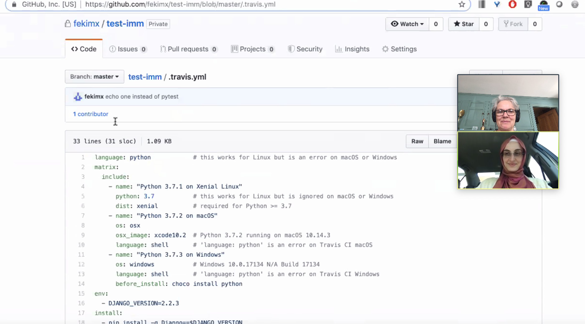
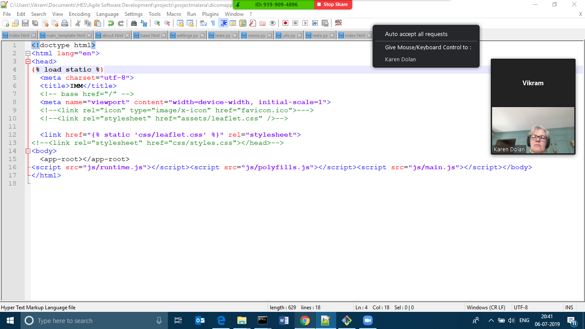
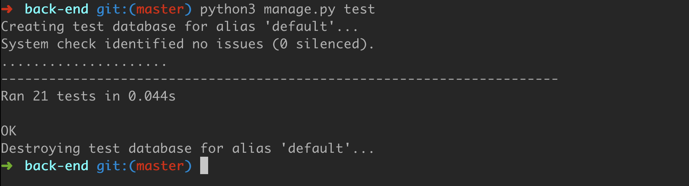
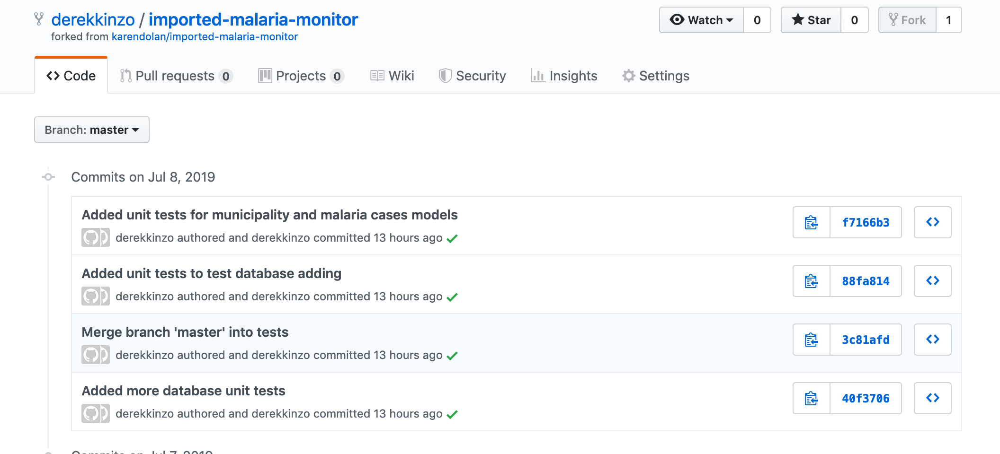
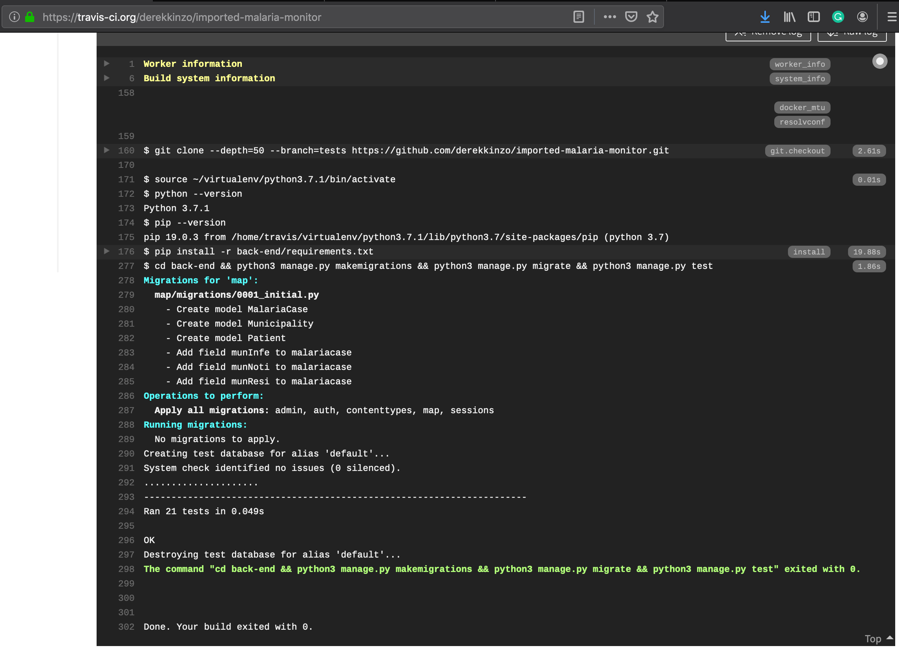
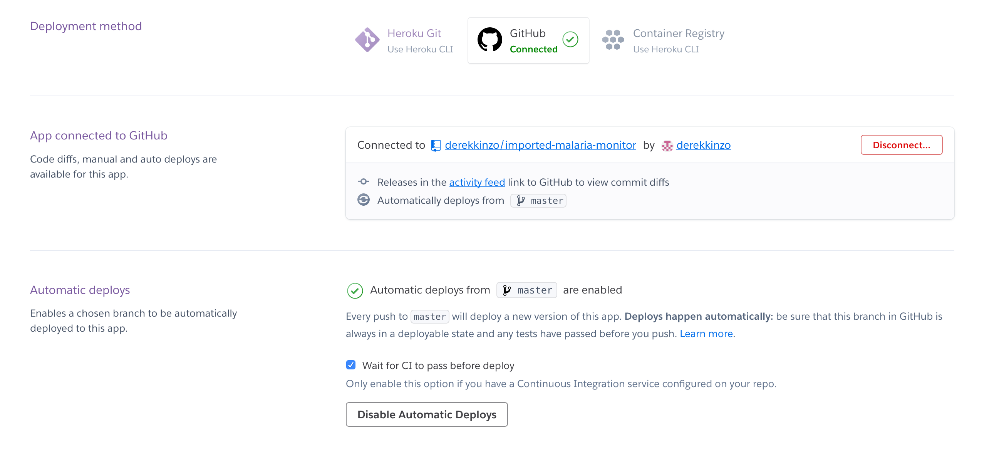
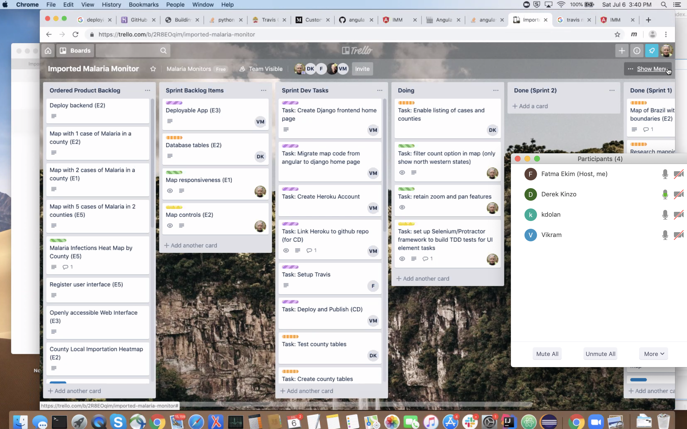

## SPRINT 2 (Ended July 8th, 3 pm)

### Forecast Velocity
Our initial velocity forecast is of 8 Story Points per Sprint. Our forecast is based on Yesterday's weather. As we progress and as the team matures, we expect to increase the velocity.

### Sprint Backlog 
Sprint 2 Backlog and Tasks can be found here: https://trello.com/b/2R8EOqim/imported-malaria-monitor

None of the stories was more than half of the velocity in this sprint; therefore, no refinement was needed.  

### What did you do in the last 24 hours that helped the Development Team meet the Sprint Goal? Annotate your team's response so it's clear which team members did which activities.

- Derek: Created tests, incorporated Travis (CI) into project, finalized heroku deployment and merge angular frontend with backend
- Fatma: Worked on Travis CI
- Karen: Did Angular-Django continious developement integration.
- Vikram:	Worked on resolving Heroku deployment related errors, Assist with Heroku deployment and writing tests.

### What will you do in the next 24 hours to help the Development Team meet the Sprint Goal? Annotate your team's response so it's clear which team members plan to do which activities.

- Derek: Finish implementing backend, set up a meeting with the stakeholder
- Fatma: Write Documentation
- Karen: Test driven design of UI elements, documentation
- Vikram: Write tests

### Impediments we had and how we removed them

Impediments included technical difficulties with the new tool sets for the project. We switched code repositories, in order for team members with the most skills with Heroku deployments could focus their effort with full admin rights. We had difficulty meeting with the stakeholder as a team in the last sprint review. This time the P.O. coordinated a meeting, where we could all meet with the stakehodler well in advance.

### Sprint 2 Burndown Chart

### Sprint 2 Mob Programming & Pair Programming

In Sprint 2, dev team members pair worked several times through Zoom conference shared screen. The following screen shots show two members assessing the Travis config and two members working on the UI elements. The Heroku integration was also a paired effort.

### Sprint 2 TDD

The Imported Malaria Monitor tests are for the two areas of the project, front-end amd back-end. Combined there are 39 test to represent stakeholder stories.

#### Front-End UI Test Driven Design

The visual elements requested by the stakeholder were written into UI unit tests.

#### Back-End Server

### Sprint 2 CI - Travis
We setup Travis CI to automatically test our code as commits are pushed to github.

### Sprint 2 CD - Heroku
We setup Heroku automatically deploy our app whenever new commits are pushed to the master branch and all tests pass the CI (Travis)

### Sprint 2 Evidence of Running Program

The front-end angular.io component demonstrating the counties of Brazil with 0 cases of Malaria.

### Sprint 2 Daily Scrums 
We performed daily scrums to inform each other where we were in progress towards the sprint goal, and to refocus efforts, and to resolve impediments as a team. We had videoconference on Friday, Saturday, and Sunday.

The following is an example from our Saturday scrum.

- Derek: Created tests and implemented databases for backend and front end listing
- Fatma: Worked on Travis CI,  Fatma's impediment was to link Travis to github because Karen was the owner of the repo and only she could hook both up. Fatma contacted Karen to resolve the issue.
- Karen: Filtered county display for NorthWestern Brazilian counties, researched Selenium and Protractor
- Vikram:	Created Heroku account,  researched Heroku deployment process, worked on resolving Heroku deployment related errors

Zoom MeetingScreenshot:

### Sprint 2 Sprint Review
The development team, the product owner, and our stakeholder Marcia had a zoom conference and demonstrated the product. We received and noted our stakeholder's feedback and revised our product backlog.
The following is the feedback from our stakeholder:

- Add year + month
- Quartiles (25, 50, 75, 100) divided in colors: 
  - top 2 shades of red (or 4 shades of red)
  - bottom 2 shades of blue
- Move legend to left hand side
- Title: Brazil by municipality instead of county: (Maranhao + tocantins) leave out for now.
- Add boundary of country and states

 

