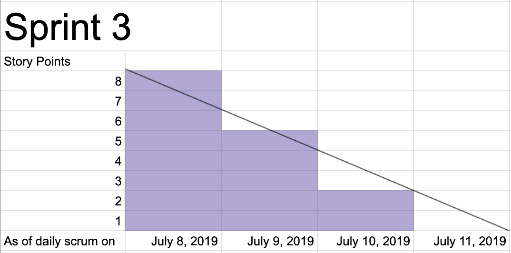
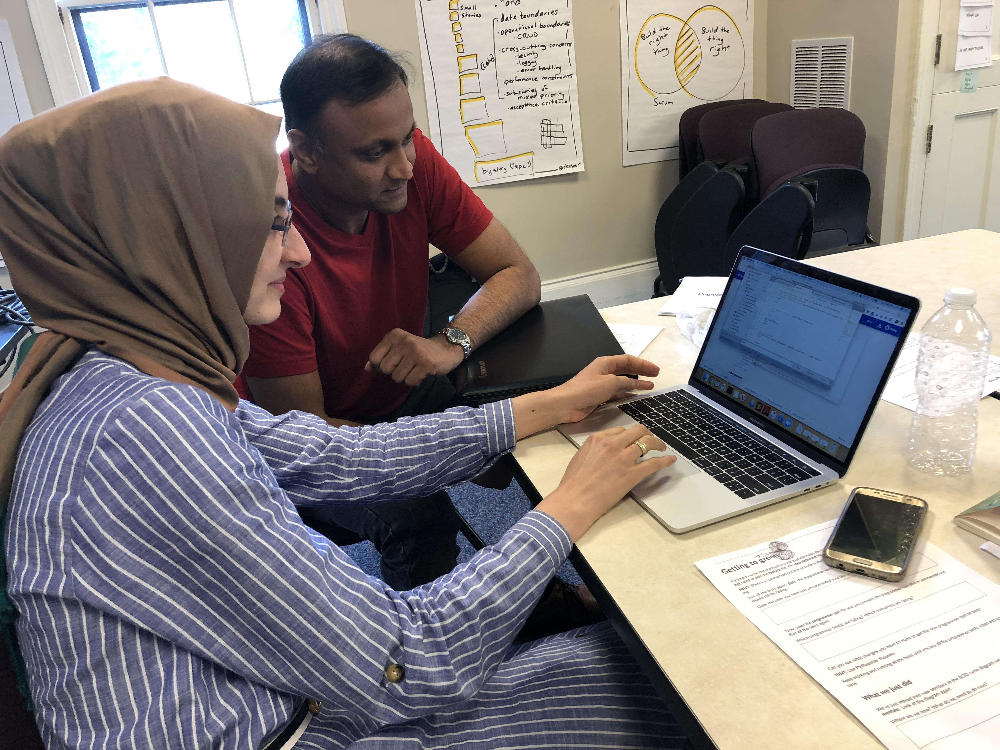
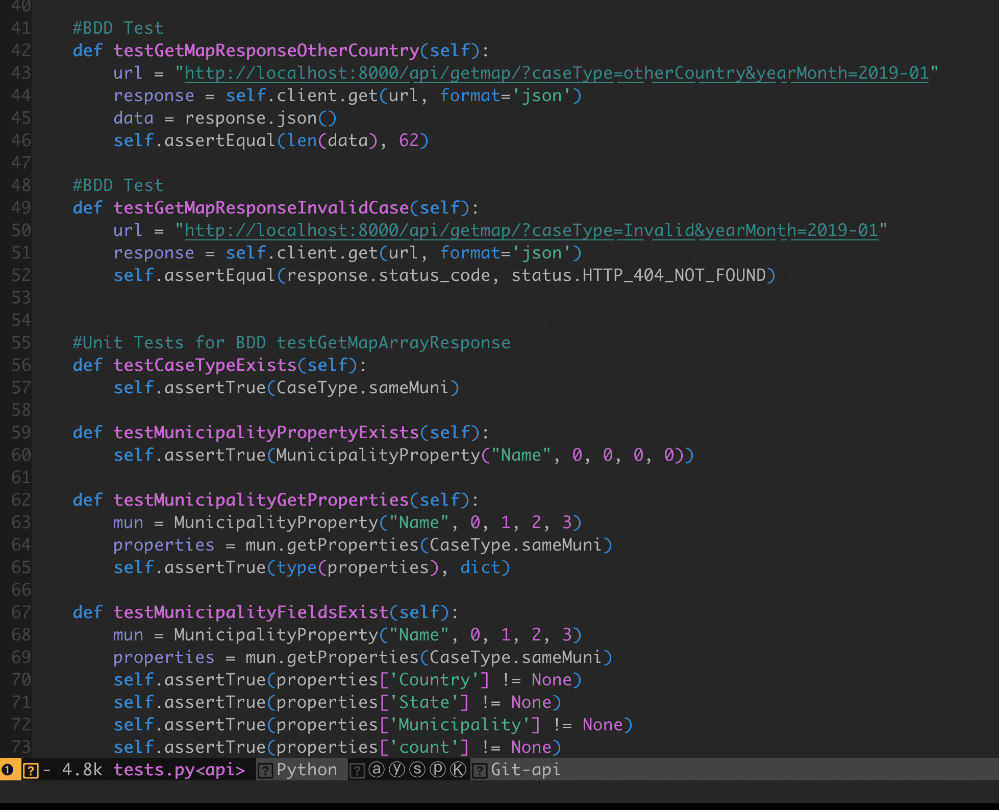
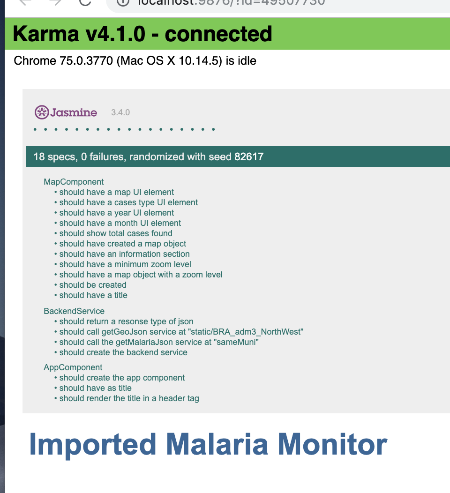
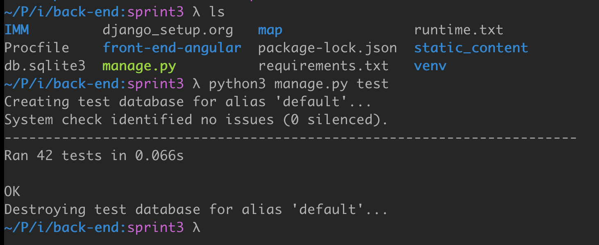
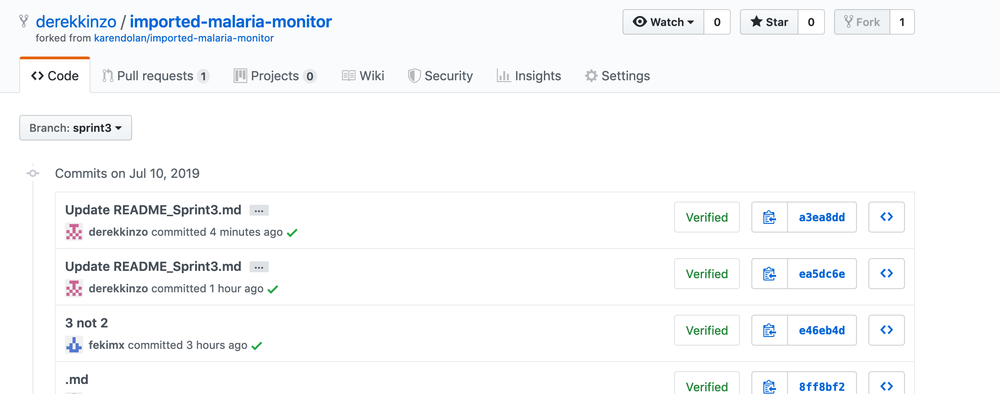
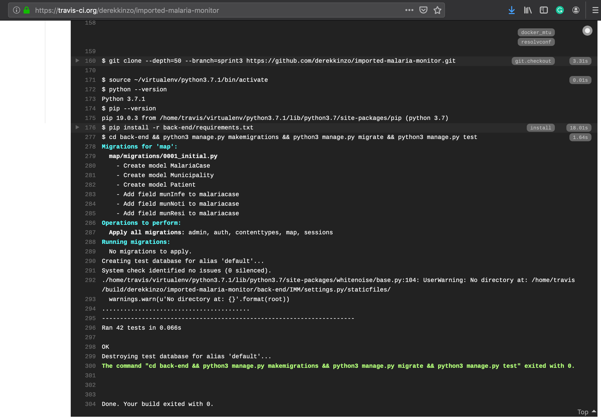
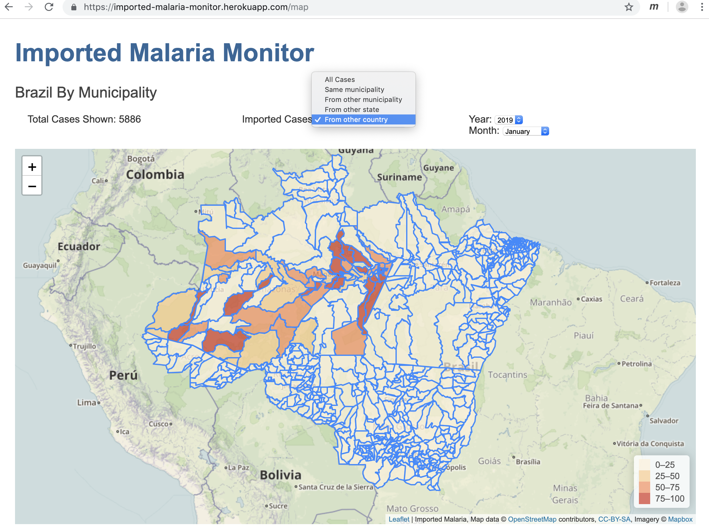
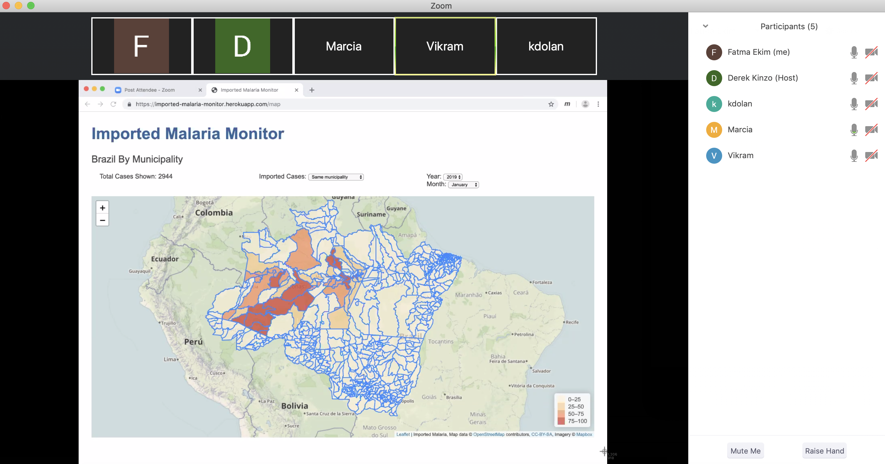

## SPRINT 3 (Due July 11th, 3 pm)

### Forecast Velocity
Our velocity forecast is of 8 Story Points for Sprint 3. Our forecast is based on Yesterday's weather since our velocity for Sprint 2 was also 8 story points.

### Sprint Backlog
Stories were pulled to sprint backlog and pulled from the top of our product backlog. None of the stories was more than half of the velocity in this sprint; therefore, no refinement was needed.  
The tasks were decomposed into tasks.

Sprint 3 Backlog and Tasks can be found here: https://trello.com/b/2R8EOqim/imported-malaria-monitor

### What did you do in the last 24 hours that helped the Development Team meet the Sprint Goal? Annotate your team's response so it's clear which team members did which activities.

- Derek: Implemented basic API functionality using TDD
- Fatma: worked on adding year to the month
- Karen: Merge malaria data with geoJson data for the map display
- Vikram: Build navigation options for the front end	

### What will you do in the next 24 hours to help the Development Team meet the Sprint Goal? Annotate your team's response so it's clear which team members plan to do which activities.

- Derek: Implement getMap request for all counties and case types using BDD
- Fatma: Write Documentation (readme and trello)
- Karen: The front UI query to retrieve back end by case type
- Vikram: Ensure quality on both font and back end 

### Impediments we had and how we removed them
There were two impediments we faced this sprint and we addressed them as follows: 

The first impediment was related to getting acces to the cases of malaria in Brasil. Initially we gave ourselves one day to be able to retrieve this data, if after that time we couldn't solve it ourselves we would delegate the task to the stakeholder. On the second day of the sprint, we still hadn't been able to get access to the database because of personally identifiable information (PII) of patients, so the stakeholder got involved and she was able to provide us the database given we didn't make it publicly available.

The second impediment we faced was due to the supported database software in heroku. Django inherently supports sqlite, but heroku works natively with postgres. We gave ourselves one day to solve this issue by diving into the documentation of django and heroku to setup the system. Since we weren't able to solve the issue in time, our fallback measure was to change the django database to postgres since postgres is supported by heroku natively.

### Sprint 3 Burndown Chart

### Sprint 3 Mob Programming & Pair Programming

### Sprint 3 BDD/TDD
The BDD and TDD tests are in api/test.py file

#### Front-End UI Test Driven Design
On front end front-end-angular directory run "ng test" 

#### Back-End Server Tests
On backend top-level directory run "python3 manage.py test" to run all backend tests.

### Sprint 3 CI - Travis

We setup Travis CI to automatically test our code as commits are pushed to github.

### Sprint 3 CD - Heroku

We setup Heroku automatically deploy our app whenever new commits are pushed to the master branch and all tests pass the CI (Travis)

### Sprint 3 Evidence of Running Program

The front-end angular.io component demonstrating the counties of Brazil with cases of Malaria.

### Sprint 3 Daily Scrums 
We performed daily scrums to inform each other where we were in progress towards the sprint goal, and to refocus efforts, and to resolve impediments as a team. We met in person after class on Monday, Tuesday, and Wednesday.

The following is an example from our Wednesday scrum.

- Derek: Done: Implemented getMap request for all counties and case types using BDD. Doing: Assisting front end integration. Impediments: none
- Fatma: Done: Got rid of Day drop down and switched month and year. Doing: Assisting on UI navigation. Impediments: Angular.io learning curve
- Karen: Done: code to merged malaria stats with geoJson layer, Doing: UI select queries to back end. Impediments: learning Angular.io http mocking layer for TDD.
- Vikram:	Done: 

Zoom MeetingScreenshot:

PLEASE ADD

### Sprint 3 Sprint Review
The development team, the product owner, and our stakeholder Marcia had a zoom conference and demonstrated the product at 9:30 am on July 11th. We received and noted our stakeholder's feedback and revised our product backlog.
The following is the feedback from our stakeholder:

NEEDS UPDATE

 
